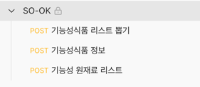
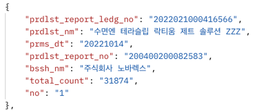
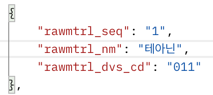
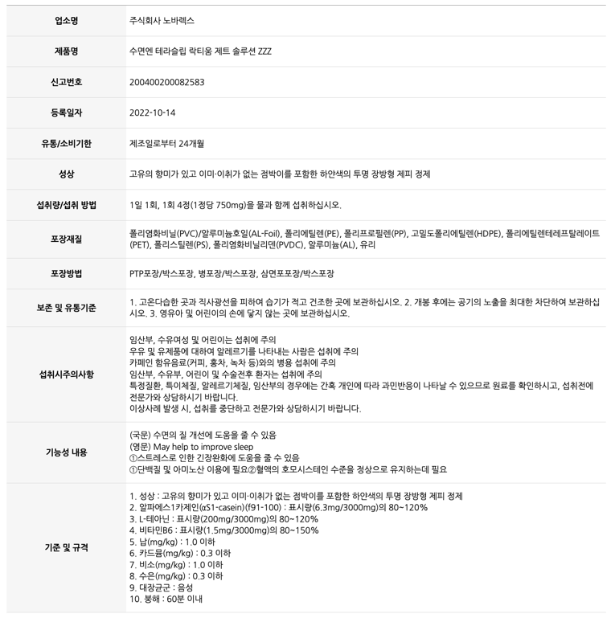

# 쏘옼 영양제 파서(크롤러)

## 기능 목록
- [x] 특정 주소에 요청하고 응답을 받아올 수 있다
  - [x] POST Form
- [x] 응답을 `HTML`, `JSON`으로 반환 할 수 있다
- [x] 응답에서 데이터 모델을 만들 수 있다.
- [ ] 데이터 모델들을 DB에 저장할 수 있다.
- [x] `HTML`에서 `기타 정보` 데이터 모델을 만들 수 있다.
- [x] `JSON`에서 `영양제`와 `원재료` 데이터 모델을 만들 수 있다.
- [ ] 컨트롤러

## 데이터 소스

[POSTMAN](https://www.postman.com/so-ok/workspace/7ae1b5e2-d0a1-43fc-bbe2-8e3ec7927061/collection/12837640-4b111503-6483-40e7-9592-0d0116131861?action=share&creator=12837640)



## 영양제

### 데이터 형태
`JSON Array`

### 모델



## 원재료
### 데이터 형태
`JSON Array`

### 모델



## 기타 정보
### 데이터 형태
`HTML <table>`
```html
(...)

<div class="page-container">
    <!-- 페이지 내용 -->
    <article>


        <table class="mb-table mb-view left-txt">
            <caption>문서정보</caption>
            <colgroup>
                <col style="width:20%">
                <col style="width:auto">
            </colgroup>
            <thead>
            <tr>
                <th scope="col" class="hidden">제목</th>
                <th scope="col" class="hidden">설명</th>
            </tr>
            </thead>
            <tbody>
            <tr>
                <th scope="row">업소명</th>
                <td>주식회사 노바렉스</td>
            </tr>
            <tr>
                <th scope="row">제품명</th>
                <td>수면엔 테라슬립 락티움 제트 솔루션 ZZZ</td>
            </tr>
            <tr>
                <th scope="row">신고번호</th>
                <td>200400200082583</td>
            </tr>
            <tr>
                <th scope="row">등록일자</th>
                <td>2022-10-14</td>
            </tr>
            <tr>
                <th scope="row">유통/소비기한</th>
                <td>제조일로부터 24개월</td>
            </tr>
            <tr>
                <th scope="row">성상</th>
                <td>고유의 향미가 있고 이미·이취가 없는 점박이를 포함한 하얀색의 투명 장방형 제피 정제</td>
            </tr>
            <!-- 
            <tr>
                <th>유형또는분류<br>(원료분류)</th>
                <td>비타민D</td>
            </tr>
             -->
            <tr>
                <th scope="row">섭취량/섭취 방법</th>
                <td>1일 1회, 1회 4정(1정당 750mg)을 물과 함께 섭취하십시오.</td>
            </tr>
            <tr>
                <th scope="row">포장재질</th>
                <td>폴리염화비닐(PVC)/알루미늄호일(AL-Foil), 폴리에틸렌(PE), 폴리프로필렌(PP), 고밀도폴리에틸렌(HDPE),
                    폴리에틸렌테레프탈레이트(PET), 폴리스틸렌(PS), 폴리염화비닐리덴(PVDC), 알루미늄(AL), 유리</td>
            </tr>
            <tr>
                <th scope="row">포장방법</th>
                <td>PTP포장/박스포장, 병포장/박스포장, 삼면포포장/박스포장</td>
            </tr>
            <tr>
                <th scope="row">보존 및 유통기준</th>
                <td>1. 고온다습한 곳과 직사광선을 피하여 습기가 적고 건조한 곳에 보관하십시오. 2. 개봉 후에는 공기의 노출을 최대한 차단하여
                    보관하십시오. 3. 영유아 및 어린이의 손에 닿지 않는 곳에 보관하십시오.</td>
            </tr>
            <tr>
                <th scope="row">섭취시주의사항</th>
                <td style="text-align:left !important;">임산부, 수유여성 및 어린이는 섭취에
                    주의<br/>우유 및 유제품에 대하여 알레르기를 나타내는 사람은 섭취에 주의<br/>카페인 함유음료(커피, 홍차, 녹차 등)와의 병용 섭취에 주의<br/>임산부, 수유부, 어린이 및 수술전후 환자는 섭취에 주의<br/>특정질환, 특이체질, 알레르기체질, 임산부의 경우에는 간혹 개인에 따라 과민반응이 나타날 수 있으므로 원료를 확인하시고, 섭취전에 전문가와 상담하시기 바랍니다.<br/>이상사례 발생 시, 섭취를 중단하고 전문가와 상담하시기 바랍니다.</td>
            </tr>
            <tr>
                <th scope="row">기능성 내용</th>
                <td style="text-align:left !important;">(국문) 수면의 질 개선에 도움을 줄 수
                    있음<br/>(영문) May help to improve sleep<br/>①스트레스로 인한 긴장완화에 도움을 줄 수 있음<br/>①단백질 및 아미노산 이용에 필요②혈액의 호모시스테인 수준을 정상으로 유지하는데 필요</td>
            </tr>
            <tr>
                <th scope="row">기준 및 규격</th>
                <td style="text-align:left !important;">1. 성상 : 고유의 향미가 있고 이미·이취가 없는 점박이를
                    포함한 하얀색의 투명 장방형 제피
                    정제<br/>2. 알파에스1카제인(αS1-casein)(f91-100) : 표시량(6.3mg/3000mg)의 80~120%<br/>3. L-테아닌 : 표시량(200mg/3000mg)의 80~120%<br/>4. 비타민B6 : 표시량(1.5mg/3000mg)의 80~150%<br/>5. 납(mg/kg) : 1.0 이하<br/>6. 카드뮴(mg/kg) : 0.3 이하<br/>7. 비소(mg/kg) : 1.0 이하<br/>8. 수은(mg/kg) : 0.3 이하<br/>9. 대장균군 : 음성<br/>10. 붕해 : 60분 이내</td>
            </tr>
            </tbody>
        </table>
        (...)
    </article>
</div>
```
- `.page-container` > `table`

### 모델

